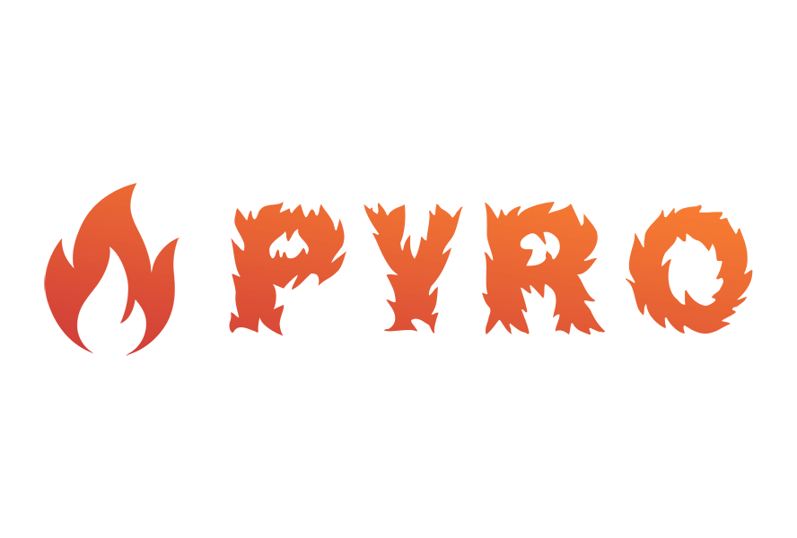
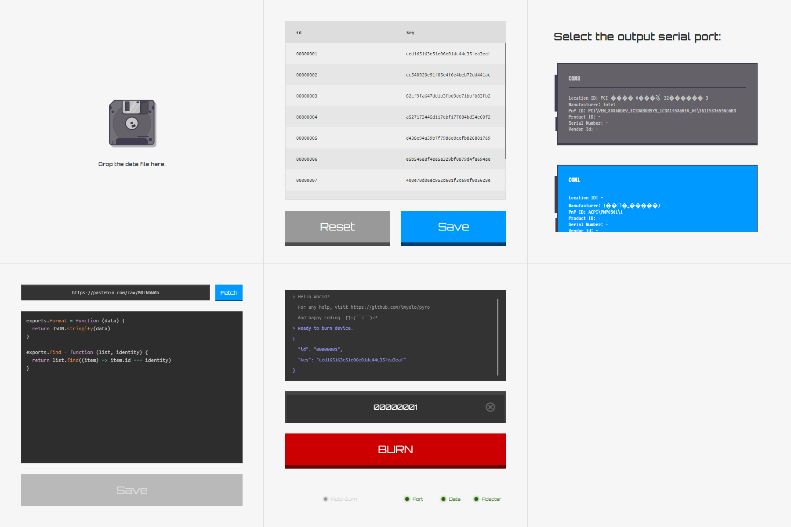

<p align="center"></p>

# PYRO
> :fire: An indexed data burning tool designed for humans

# Screenshot
[](./_medias/screenshots/)

## Get started
### Setup
1. Insert your burning board into the USB slot.
2. Drop your csv into the app. For example, check [./test/fixtures/standard.csv](./test/fixtures/standard.csv).
3. Select the correct serial port in the app.
4. Fetch your adapter code from the network and save it. If you don't know how to use it, try [the default options](https://pastebin.com/raw/M0rNhW6h) we offer first.
5. Now you're ready.

### Burn
We recommend that you use the qrcode scanner and turn on the Auto-Return mode. The scanner can work perfectly for you with the Auto-Burn mode of Pyro.

After you enter the identification of the device, the program will find the corresponding data for you from the data table, format and output to the specified serial port, complete the burning job.

## Advanced
### Adapter
To enable you to use pyro to burn any format of data into the hardware, we designed the Adapter model in pyro.
You can create an adapter of your own by implementing the following two methods:

- format(data)
- find(list, identity)

For example:

```javascript
exports.format = function (data) {
  return JSON.stringify(data)
}

exports.find = function (list, identity) {
  return list.find((item) => item.id === identity)
}
```

## FAQ
## Don't have permission to open a port in Linux
When using Pyro in Linux, you are likely to receive an error that you do not have permission to open the port.
In this case, you can simply use ``sudo`` to elevator. However, we recommend that you get permissions by running Pyro as a ``dialout`` user group.
For example:

```bash
# add user to the dialout gorup
sudo adduser ${username} dialout

# change current group
newgrp dialout

# launch Pyro in development mode
npm run dev
```

For more information, see [node-serialport#1297](https://github.com/node-serialport/node-serialport/issues/1297).


## How to participate in contributing code
### Required Softwares
- Node.js >= 8
- NPM >= 5.6

### Installing dependencies
```bash
npm i
```

### Developing
```bash
npm run dev
```

### Building executable binary file
First, the environment for a win32 platform is required, because we need to build a win32 binary executable (.exe) for our embedded engineer partners, who are used to working on the win32 environment.

If you don't, check [electron-userland/electron-builder : Multi platform build](https://www.electron.build/multi-platform-build).

Build it:

```bash
npm run dist
```

Or if the above method fails:

```bash
npm run dist:retry:win
```

Then check ``dist/pyro x.y.z.exe``.

Good luck.

## FAQ
### How to clear cache?
On the win32 platform, you can clear the Pyro cache by deleting ``~/AppData/Roaming/pyro`` directory. For more information, see [sindresorhus/electron-store](https://github.com/sindresorhus/electron-store).
